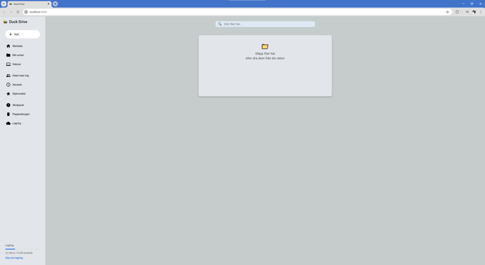
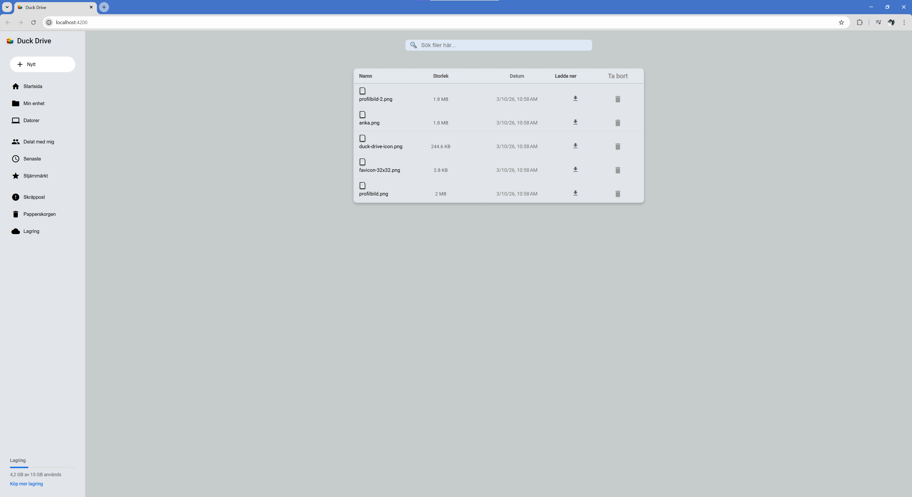
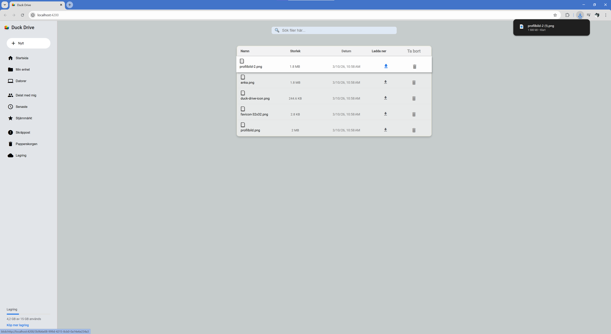

# Duck Drive (Proof of Concept)

En prototyp av en webbapplikation inspirerad av Google Drive. Projektet byggdes som ett grupparbete i Angular och fokuserade på att utforska komponentbaserad frontend-utveckling och användarinteraktion.

Den nuvarande versionen demonstrerar layouten för en filhanterare samt en proof-of-concept implementation av drag-and-drop.



## Status

Detta projekt är en Proof of Concept och innehåller endast delar av den planerade funktionaliteten.

Det som fungerar i nuläget:

- Drag & Drop av filer till gränssnittet
- Nedladdning av filerna
- Radering av filer
- Layout inspirerad av Google Drive


## Teknologier

- Angular

- TypeScript

- HTML

- CSS

## Exempelbilder

### Drag and Drop


### Download



## Min roll i projektet

Detta projekt utvecklades som ett grupparbete. Mitt arbete fokuserade främst på:

1. utveckling av Angular-komponenter

2. arbete med layout och UI-struktur

3. medverkan i implementationen av drag-and-drop funktionalitet

Jag arbetade främst med användargränssnittet, medan en annan gruppmedlem hade 
huvudansvar för den tekniska implementationen av drag-and-drop-logiken.


## Köra projektet lokalt

Installera dependencies:

```bash
npm install
```

Starta utvecklingsservern:
```
ng serve
```
Öppna sedan:
```
http://localhost:4200
```
